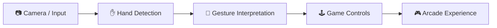
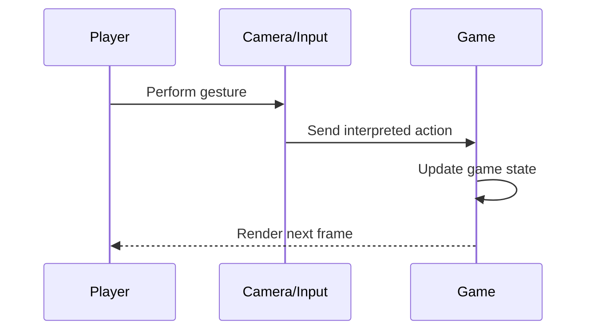
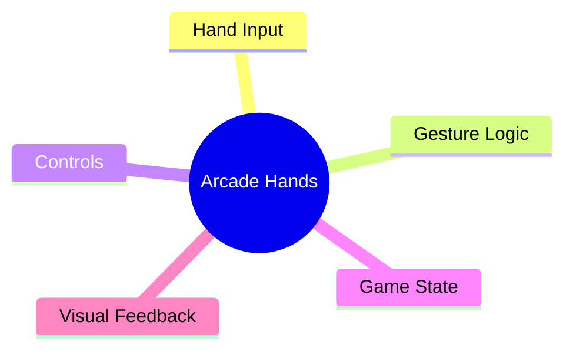

# 🕹️ Arcade Hands

> A browser-based interactive arcade experience built around hand-driven interaction.


## ✋ Interaction Pipeline


## 🔄 Gameplay Loop


## 🗺️ Game Map


## 📂 Structure
```text
├── index.html
└── README.md
```

---

### 👨‍💻 Created by **Priyanshu**
