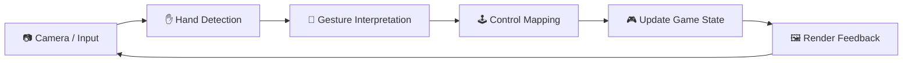
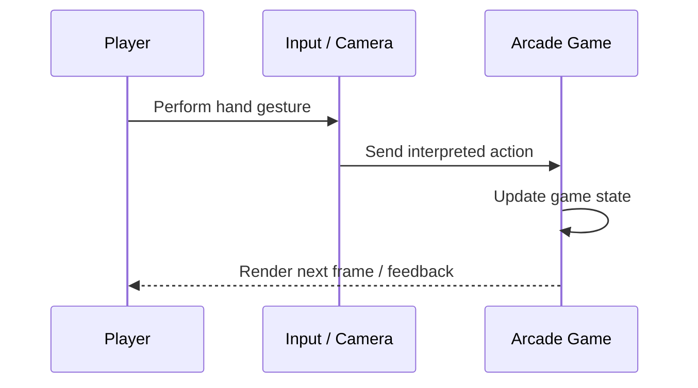
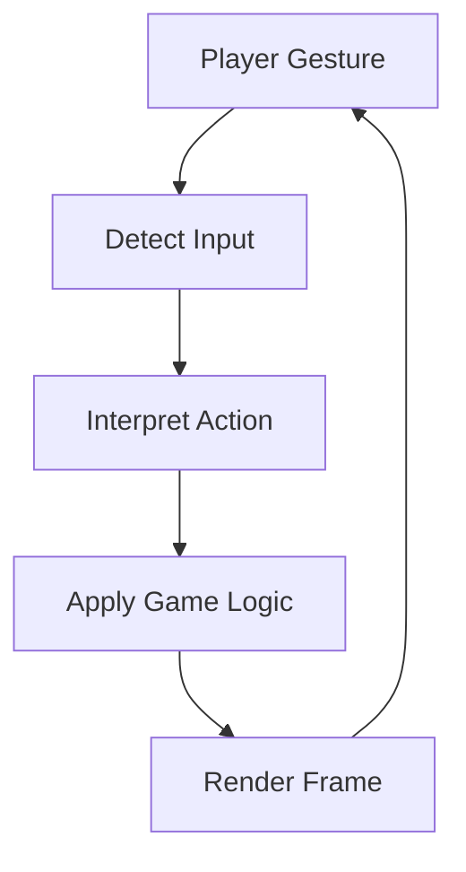
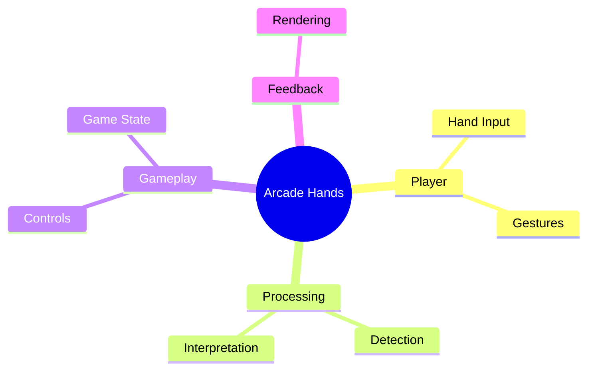

# 🕹️ Arcade Hands

<p align="center"><b>A browser-based interactive arcade experience built around hand-driven input, gesture interpretation, and real-time gameplay.</b></p>

<p align="center">


</p>

---

## 🎮 Overview

**Arcade Hands** explores a more physical way to interact with a browser game. Instead of relying only on conventional controls, the experience is structured around interpreting hand input and translating that interaction into gameplay actions.

The project brings together **camera/input capture, hand or gesture interpretation, game controls, state updates, and visual feedback** inside a browser-based experience.

## ✨ Features

- ✋ Hand-driven interaction concept
- 📷 Camera/input capture workflow
- 🧠 Gesture interpretation
- 🕹️ Gesture-to-control mapping
- 🎮 Real-time gameplay updates
- 🌐 Browser-based implementation

## 🏗️ Interaction Pipeline



## 🔄 Gameplay Loop



## ⚙️ How It Works

1. The application receives visual or hand-driven input.
2. The input is interpreted into a usable gesture or action.
3. That action is mapped to a game control.
4. The game updates its internal state.
5. The next frame provides visual feedback to the player.
6. The loop repeats continuously during gameplay.



## 📂 Project Structure

```text
Arcade-hands/
├── index.html     # Main browser application
└── README.md      # Project documentation
```

## 🚀 Run Locally

Clone the repository:

```bash
git clone https://github.com/Priyanshu710-ui/Arcade-hands.git
cd Arcade-hands
```

Open `index.html` in a browser. If the project requires browser permissions for its input workflow, allow the relevant permissions when prompted.

## 🛠️ Technology Role

| Component | Purpose |
|---|---|
| Browser | Runs the interactive experience |
| HTML/CSS/JS | Builds the game interface and logic |
| Input Layer | Captures player interaction |
| Gesture Logic | Converts interpreted input into actions |
| Game Loop | Updates and renders gameplay |

## 🎯 Why Hand-Based Interaction?

Hand-driven controls can make browser experiences feel more direct and experimental. This project demonstrates how an interaction pipeline can connect **physical movement → interpreted gesture → digital action**.

## 🗺️ Game Map



## 🔮 Future Ideas

- [ ] Add more gesture-controlled games
- [ ] Add difficulty levels and scoring
- [ ] Add calibration controls
- [ ] Add mobile-friendly interaction modes
- [ ] Add performance and input-latency metrics

---

### 👨‍💻 Created by **Priyanshu**

⭐ If you like the idea, give the repository a star!
